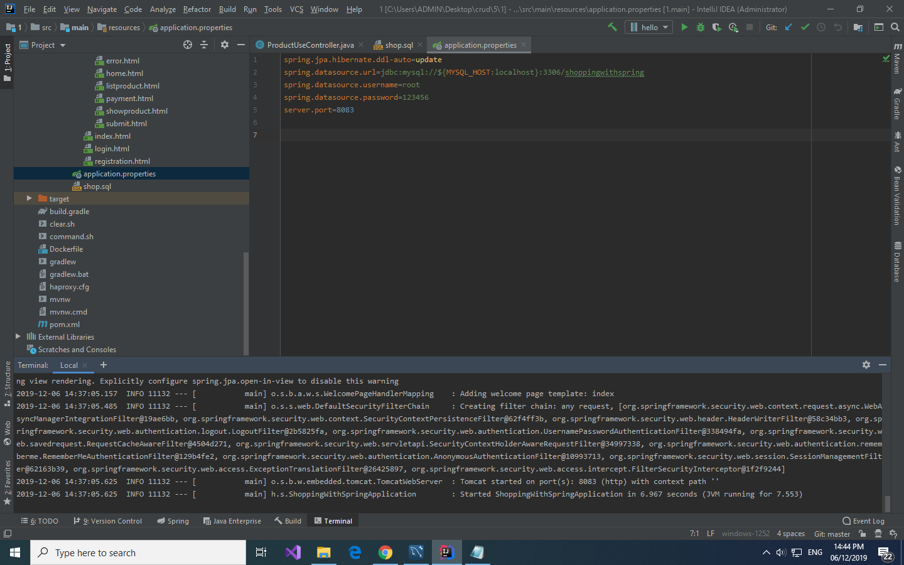
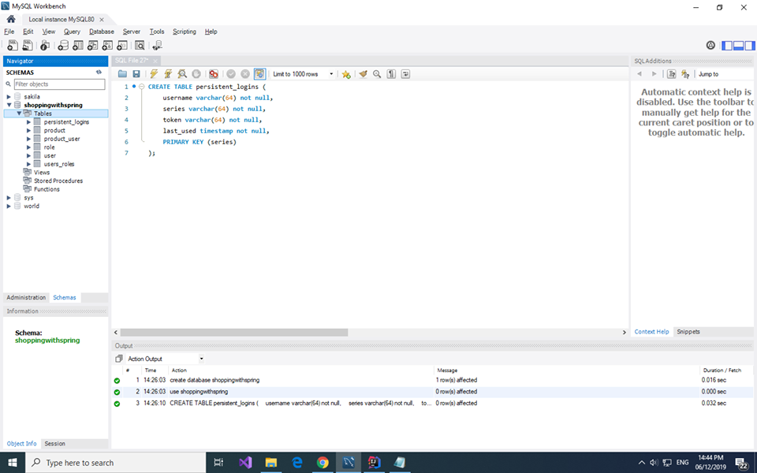
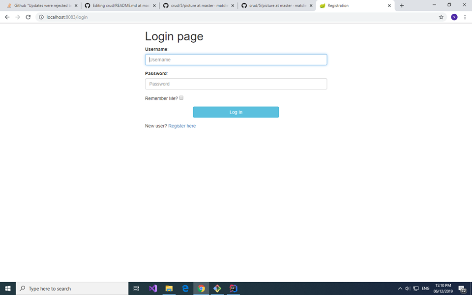
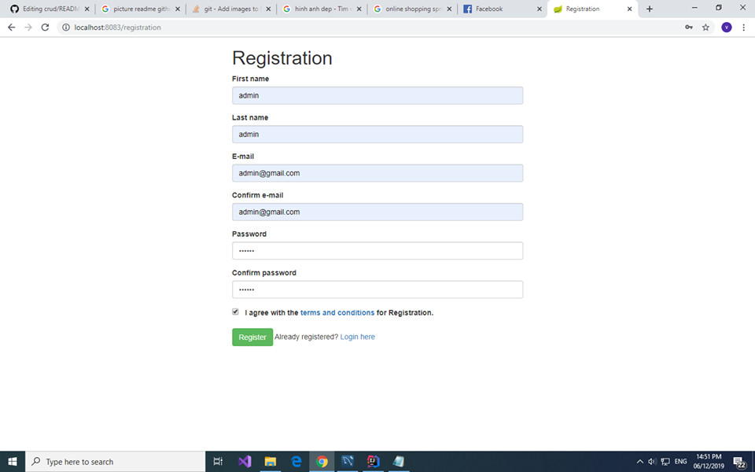
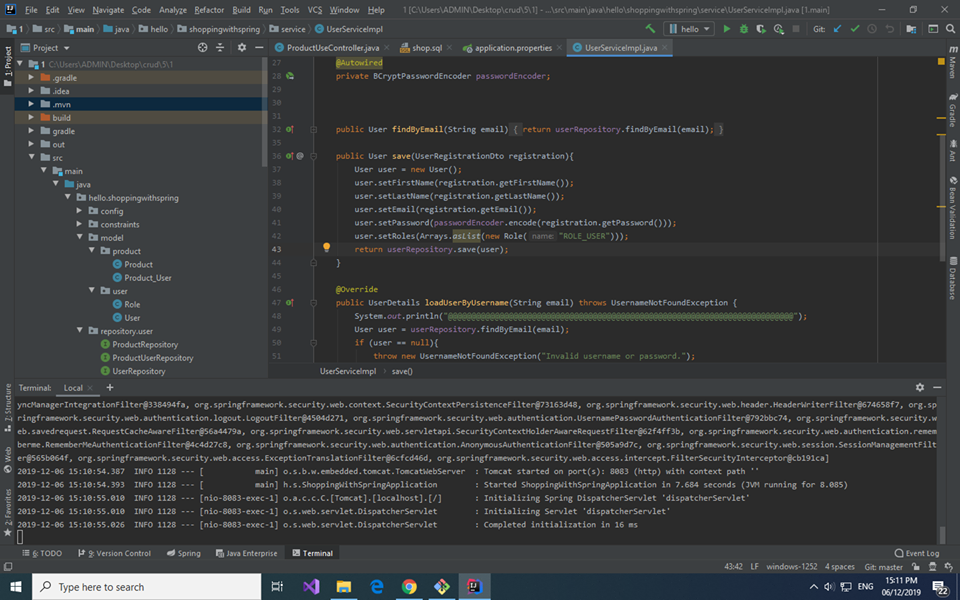

READ ME
SHOPPING ONLINE

Hướng dẫn chạy project

Bước 1: Tạo database:
Tạo database shoppingwithspring:
        create database shoppingwithspring
        
Bước 2:Tạo bảng persistent_logins:

CREATE TABLE persistent_logins (
    username varchar(64) not null,
    series varchar(64) not null,
    token varchar(64) not null,
    last_used timestamp not null,
    PRIMARY KEY (series)
);

(Bảng duy nhất phải tạo để lưu tooken duy trì đăng nhập các bảng khác sẽ được tự tạo với hibernate)

Bước 3:Mở file bằng intellij ide và  sửa đổi username và password trong application.properties thành username và password trong mysql của bạn

=======
Bước 3: sửa đổi username và password trong application.properties thành username và password trong mysql của bạn

Bước 4 chạy project bằng terminal trong intellij:

Lệnh dịch file jar:
        mvnw clean package

Lệnh chạy chương trình:

        java -jar target\hello.jar         (window)
        java -jar target/hello.jar         (linux)
        
        
Sau khi chạy xong project các bảng sẽ được tạo trong database như hình:

Bước 5: vào localhost:8083 bạn sẽ thấy trang web login 

Bước 6: kick vào đăng ký để tạo 1 tài khoản

Ban đầu mình có để cho user đăng ký là admin sẽ có được tất cả các quyền của trang web. Bạn đăng ký 1 cái để sử dụng
Sau đó bạn có thể cho người dùng đăng ký với quyền user bằng các đổi ROLE_ADMIN thành ROLE_USER như hình ảnh tại file UserServiceImpl
Lúc này người đăng ký sẽ có quyền user nên sẽ không có chức năng thêm là sưa thông tin san phẩm
Lưu ý  là bạn phải ctrl c dừng chương trình lại và chạy lại chương trình sau khi sửa code nhé!

Ok rồi bây giờ bạn có thể đăng nhập để sài thử web
Mà có 1 lưu ý nữa là khi admin up ảnh, do ảnh mình chưa up vào file target nên muốn xuất hiện bạn pải dịch lại và chạy lại chương trình như bước 3 :(((

